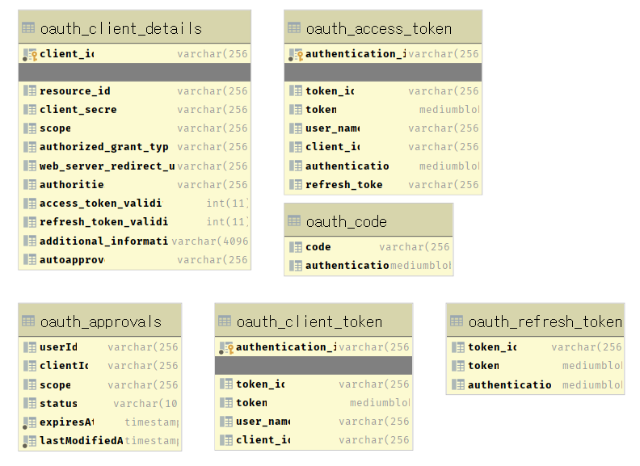
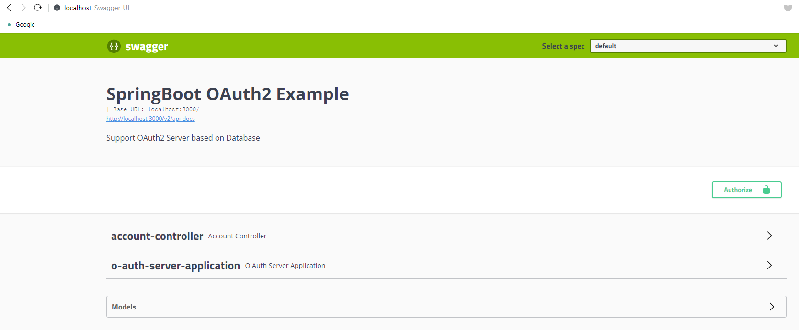
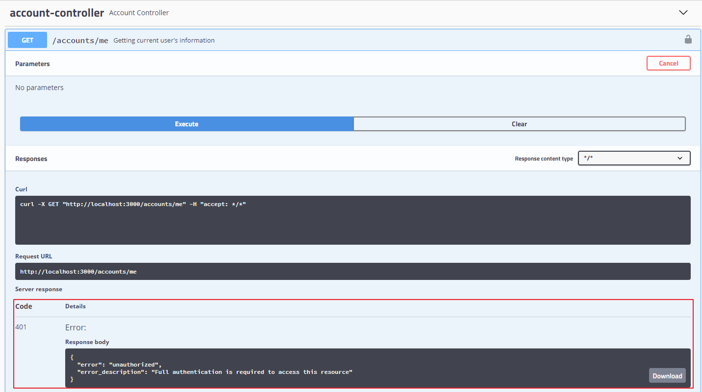
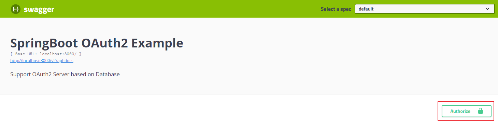
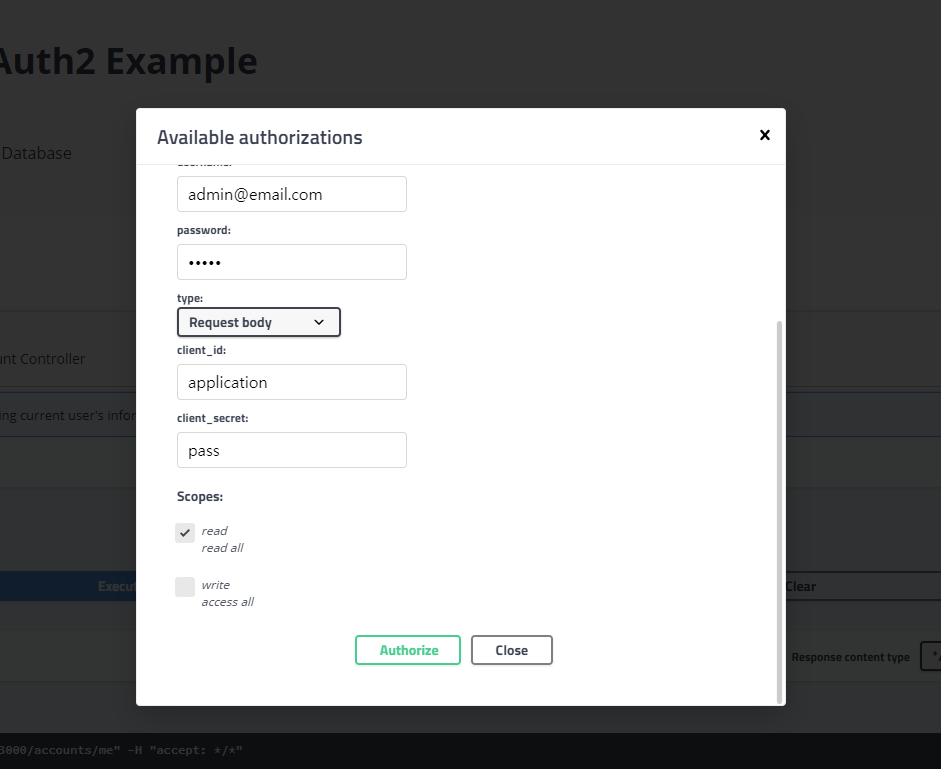
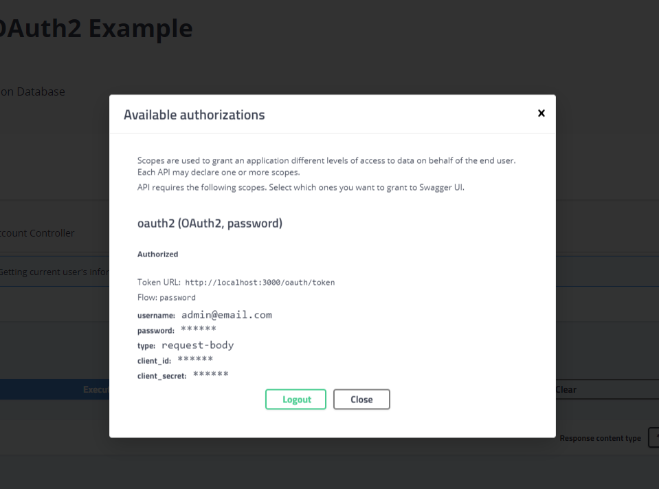
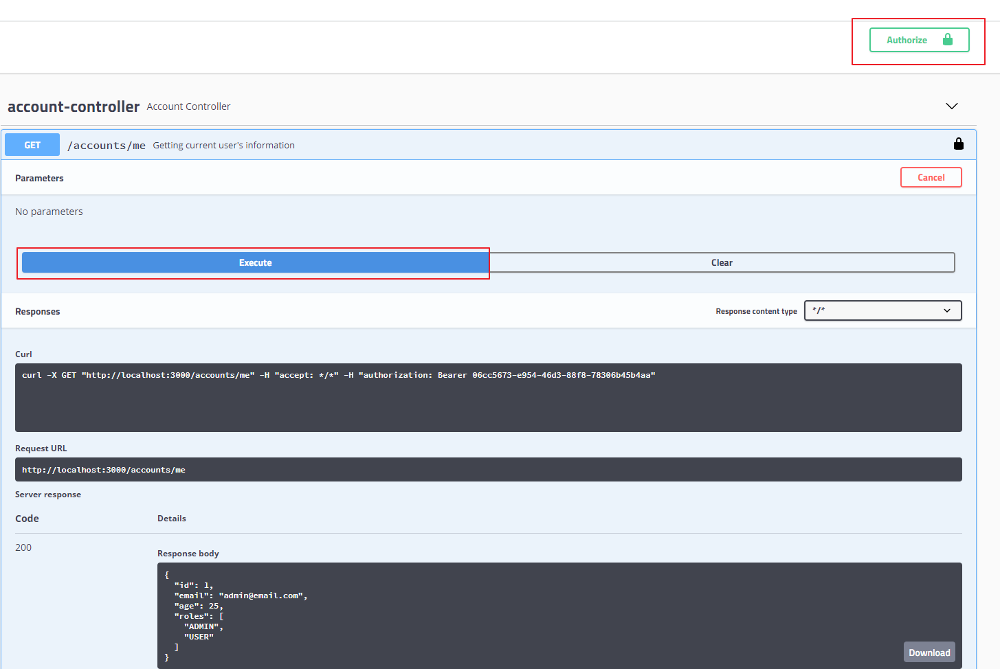

# Spring Security + OAuth2(JDBC) + Swagger 서버 구축하기   

전체 내용는 [github](https://github.com/zacscoding/springboot-oauth2-example) 에서 확인할 수 있습니다 (스타는 사랑입니다)  

---  

Spring security + OAuth2(JDBC) + Swagger를 모두 설명하기 보다는  

구현에 초점을 두겠습니다. 또한 UserDetailService등의 구현 설명은 생략 하겠습니다.  

## Index  

- <a href="#dependencies">의존성 추가</a>  
- <a href="#configurer">스프링 관련 설정</a>  
- <a href="#oauth2-jdbc">JDBC 기반 OAuth2</a>  
- <a href="#run-server">프로젝트 실행</a>  
- <a href="#test-swagger-ui">테스트(SWAGGER-UI)</a>  
- <a href="#test-junit">테스트(JUNIT)</a>  

---  

<div id="dependencies"></div>

### 의존성 추가  

Security, OAuth2, Swagger 관련 의존성 추가

-  `org.springframework.boot:spring-boot-starter-security`
-  `org.springframework.security.oauth.boot:spring-security-oauth2-autoconfigure:2.1.7.RELEASE`
-  `io.springfox:springfox-swagger2:2.9.2`
- `io.springfox:springfox-swagger-ui:2.9.2`  

> build.gradle  

```
dependencies {
    // spring
    compile 'org.springframework.boot:spring-boot-starter-web'
    compile 'org.springframework.boot:spring-boot-starter-data-jpa'
    compile 'org.springframework.boot:spring-boot-starter-security'
    compile 'org.springframework.security.oauth.boot:spring-security-oauth2-autoconfigure:2.1.7.RELEASE'
    annotationProcessor "org.springframework.boot:spring-boot-configuration-processor"

    // jpa
    compile "org.mariadb.jdbc:mariadb-java-client:2.4.3"
    compile 'com.h2database:h2'

    // swagger
    compile 'io.springfox:springfox-swagger2:2.9.2'
    compile 'io.springfox:springfox-swagger-ui:2.9.2'

    // model mapper
    compile 'org.modelmapper:modelmapper:2.3.1'
    // apache common io
    implementation 'commons-io:commons-io'

    // tests
    testCompile 'org.springframework.security:spring-security-test'
}

bootRun {
    // jvm options
    if (project.hasProperty('jvmArgs')) {
        jvmArgs project.jvmArgs.split('\\s+')
    }

    // arguments
    if (project.hasProperty('args')) {
        args project.args.split('\\s+')
    }
}
```  


---  

<div id="configurer"></div>

### 스프링 관련 설정  

스프링 관련 설정은 크게 3가지가 필요합니다.  

- `WebSecurityConfigurer` : 스프링 시큐리티 관련 설정
- `AuthorizationServerConfigurer` : Auth server 관련 설정
- `ResourceServerConfigurer` : Resource server 관련 설정  
- `SwaggerConfiguration` : Swagger 관련 설정  


> SecurityConfiguration (WebSecurityConfigurer)  

```java
import org.springframework.context.annotation.Bean;
import org.springframework.context.annotation.Configuration;
import org.springframework.security.authentication.AuthenticationManager;
import org.springframework.security.config.annotation.authentication.builders.AuthenticationManagerBuilder;
import org.springframework.security.config.annotation.web.builders.WebSecurity;
import org.springframework.security.config.annotation.web.configuration.EnableWebSecurity;
import org.springframework.security.config.annotation.web.configuration.WebSecurityConfigurerAdapter;
import org.springframework.security.crypto.password.PasswordEncoder;

import lombok.RequiredArgsConstructor;
import server.account.service.AccountService;

@RequiredArgsConstructor
@Configuration
@EnableWebSecurity
public class SecurityConfiguration extends WebSecurityConfigurerAdapter {

    private final AccountService accountService;
    private final PasswordEncoder passwordEncoder;

    @Bean
    @Override
    public AuthenticationManager authenticationManagerBean() throws Exception {
        return super.authenticationManagerBean();
    }

    @Override
    public void configure(WebSecurity web) throws Exception {
        // swagger 관련 리소스 시큐리티 필터 제거
        web.ignoring().antMatchers(
                "/v2/api-docs", "/swagger-resources/**",
                "/swagger-ui.html", "/webjars/**", "/swagger/**");
    }

    @Override
    protected void configure(AuthenticationManagerBuilder auth) throws Exception {
        auth.userDetailsService(accountService)
            .passwordEncoder(passwordEncoder);
    }
}
```  


> ResourceServerConfigurer (ResourceServerConfigurer)  

`@EnableResourceServer` 기반으로 리소스 서버 설정

```java
import org.springframework.context.annotation.Configuration;
import org.springframework.http.HttpMethod;
import org.springframework.security.config.annotation.web.builders.HttpSecurity;
import org.springframework.security.oauth2.config.annotation.web.configuration.EnableResourceServer;
import org.springframework.security.oauth2.config.annotation.web.configuration.ResourceServerConfigurerAdapter;
import org.springframework.security.oauth2.config.annotation.web.configurers.ResourceServerSecurityConfigurer;
import org.springframework.security.oauth2.provider.error.OAuth2AccessDeniedHandler;

@Configuration
@EnableResourceServer
public class ResourceServerConfiguration extends ResourceServerConfigurerAdapter {

    @Override
    public void configure(ResourceServerSecurityConfigurer resources) throws Exception {
        resources.resourceId("examples");
    }

    @Override
    public void configure(HttpSecurity http) throws Exception {
        http.headers().frameOptions().disable();
        http.anonymous()
            .and()
            .authorizeRequests()
            .mvcMatchers(HttpMethod.GET, "/api/hello")
            .permitAll()
            .anyRequest()
            .authenticated()
            .and()
            .exceptionHandling()
            .accessDeniedHandler(new OAuth2AccessDeniedHandler());
    }
}
```  


> AuthServerConfiguration (AuthorizationServerConfigurer)  

`@EnableAuthorizationServer` 기반으로 인증서버 설정

```java
import org.springframework.context.annotation.Bean;
import org.springframework.context.annotation.Configuration;
import org.springframework.security.authentication.AuthenticationManager;
import org.springframework.security.crypto.password.PasswordEncoder;
import org.springframework.security.oauth2.config.annotation.configurers.ClientDetailsServiceConfigurer;
import org.springframework.security.oauth2.config.annotation.web.configuration.AuthorizationServerConfigurerAdapter;
import org.springframework.security.oauth2.config.annotation.web.configuration.EnableAuthorizationServer;
import org.springframework.security.oauth2.config.annotation.web.configurers.AuthorizationServerEndpointsConfigurer;
import org.springframework.security.oauth2.config.annotation.web.configurers.AuthorizationServerSecurityConfigurer;
import org.springframework.security.oauth2.provider.approval.ApprovalStore;
import org.springframework.security.oauth2.provider.approval.JdbcApprovalStore;
import org.springframework.security.oauth2.provider.token.TokenStore;
import org.springframework.security.oauth2.provider.token.store.JdbcTokenStore;

import lombok.RequiredArgsConstructor;
import server.account.service.AccountService;

@RequiredArgsConstructor
@Configuration
@EnableAuthorizationServer
public class AuthServerConfiguration extends AuthorizationServerConfigurerAdapter {

    // required
    private final PasswordEncoder passwordEncoder;
    private final AuthenticationManager authenticationManager;
    private final AccountService accountService;
    private final DataSource dataSource;

    @Override
    public void configure(AuthorizationServerSecurityConfigurer security) throws Exception {
        security.passwordEncoder(passwordEncoder);
    }

    @Override
    public void configure(ClientDetailsServiceConfigurer clients) throws Exception {
        clients.jdbc(dataSource);
    }

    @Override
    public void configure(AuthorizationServerEndpointsConfigurer endpoints) throws Exception {
        endpoints.authenticationManager(authenticationManager)
                 .userDetailsService(accountService)
                 .tokenStore(tokenStore())
                 .approvalStore(approvalStore());
    }

    @Bean
    public TokenStore tokenStore() {
        return new JdbcTokenStore(dataSource);        
    }

    @Bean
    public ApprovalStore approvalStore() {
        return new JdbcApprovalStore(dataSource);
    }
}
```  


> SwaggerConfiguration  

기존의 Swagger 설정에서  `.securityContexts(), securitySchemes()` 를 추가하여  

Swagger UI에서도 인증을 이용 할 수 있도록 설정 해주었습니다.  


```java
import java.util.ArrayList;
import java.util.Arrays;
import java.util.Collections;
import java.util.List;

import org.springframework.context.annotation.Bean;
import org.springframework.context.annotation.Configuration;

import lombok.RequiredArgsConstructor;
import server.account.annotation.AuthPrincipal;
import server.config.properties.ApplicationProperties;
import springfox.documentation.builders.ApiInfoBuilder;
import springfox.documentation.builders.PathSelectors;
import springfox.documentation.builders.RequestHandlerSelectors;
import springfox.documentation.service.ApiInfo;
import springfox.documentation.service.AuthorizationScope;
import springfox.documentation.service.GrantType;
import springfox.documentation.service.OAuth;
import springfox.documentation.service.ResourceOwnerPasswordCredentialsGrant;
import springfox.documentation.service.SecurityReference;
import springfox.documentation.spi.DocumentationType;
import springfox.documentation.spi.service.contexts.SecurityContext;
import springfox.documentation.spring.web.plugins.Docket;
import springfox.documentation.swagger2.annotations.EnableSwagger2;

@RequiredArgsConstructor
@Configuration
@EnableSwagger2
public class SwaggerConfiguration {

    private final ApplicationProperties properties;

    @Bean
    public Docket api() {
        final ApiInfo apiInfo = new ApiInfoBuilder()
                .title("SpringBoot OAuth2 Example")
                .description("Support OAuth2 Server based on Database")
                .build();

        return new Docket(DocumentationType.SWAGGER_2)
                .apiInfo(apiInfo)
                .ignoredParameterTypes(AuthPrincipal.class)
                .select()
                .apis(RequestHandlerSelectors.basePackage("server"))
                .paths(PathSelectors.any())
                .build()
                .securityContexts(Collections.singletonList(securityContext()))
                .securitySchemes(Arrays.asList(securitySchema()));
    }

    private SecurityContext securityContext() {
        return SecurityContext.builder()
                              .securityReferences(defaultAuth())
                              .build();
    }

    private List<SecurityReference> defaultAuth() {
        final AuthorizationScope[] authorizationScopes = new AuthorizationScope[] {
                new AuthorizationScope("read", "read all"),
                new AuthorizationScope("write", "write all")
        };

        return Collections.singletonList(new SecurityReference("oauth2", authorizationScopes));
    }

    private OAuth securitySchema() {
        final List<AuthorizationScope> authorizationScopeList = new ArrayList<>(2);

        authorizationScopeList.add(new AuthorizationScope("read", "read all"));
        authorizationScopeList.add(new AuthorizationScope("write", "access all"));

        final List<GrantType> grantTypes = new ArrayList<>(1);
        // 토큰 end point (http://localhost:3000/oauth/token)
        grantTypes.add(new ResourceOwnerPasswordCredentialsGrant(properties.getSwagger().getAccessTokenUri()));

        return new OAuth("oauth2", authorizationScopeList, grantTypes);
    }
}
```


---  

<div id="oauth2-jdbc"></div>

### JDBC 기반 OAuth2  

JDBC 기반의 OAuth2 서버를 제공하기 위해서는 먼저 데이터베이스에 관련 테이블이 존재  

해야 하는데요 https://github.com/spring-projects/spring-security-oauth/blob/master/spring-security-oauth2/src/test/resources/schema.sql 에서 확인이 가능합니다.  

위의 스키마 기반으로 ERD를 살펴보면 아래와 같습니다.  

   

위의 `AuthServerConfiguration` 에서 JDBC 관련 된 설정을 크게 3가지 했습니다.   

첫번째로 `org.springframework.security.oauth2.provider.ClientDetailsService` 관련 설정입니다.

```java
@Override
public void configure(ClientDetailsServiceConfigurer clients) throws Exception {
    // JdbcClientDetailsServiceBuilder 기반으로 JdbcClientDetailsService 생성
    clients.jdbc(dataSource);
}
```  

ClientDetailsService은 oauth_client_details 테이블에서 PK값(client_id)을 기반으로  

클라이언트 정보를 조회합니다.  

두번째로 `org.springframework.security.oauth2.provider.token.TokenStore` 관련 설정입니다.  

```java
@Override
public void configure(AuthorizationServerEndpointsConfigurer endpoints) throws Exception {
    endpoints.authenticationManager(authenticationManager)
             ...
             .tokenStore(tokenStore())
             ...;
}

@Bean
public TokenStore tokenStore() {
    return new JdbcTokenStore(dataSource);
}
```  

TokenStore는 토큰 관련 정보를 Persistence 하기 위한 인터페이스 입니다.  

`oauth_access_token`과 `oauth_refresh_token` 테이블에 토큰 관련 정보를  

읽기/쓰기/삭제를 수행합니다.  

마지막으로 `org.springframework.security.oauth2.provider.approval.ApprovalStore` 관련 설정입니다.  

```java
@Override
public void configure(AuthorizationServerEndpointsConfigurer endpoints) throws Exception {
    endpoints.authenticationManager(authenticationManager)
             ...
             .approvalStore(approvalStore());
}

@Bean
public ApprovalStore approvalStore() {
    return new JdbcApprovalStore(dataSource);
}
```  

ApprovalStore는 리소스 소유자의 승인을 Saving, Retrieving, Revoking 위한 인터페이스 입니다.  

`oauth_approvals` 테이블에 관련 정보가 저장 됩니다.  

위의 인터페이스들의 구현체인 JdbcXXX는 모두 Spring jdbc template 기반으로  

각 클래스에 상수로 관련 SQL문을 적용하여 사용하고 있습니다.  

> org.springframework.security.oauth2.provider.token.store.JdbcTokenStore  

```java
public class JdbcTokenStore implements TokenStore {

	private static final Log LOG = LogFactory.getLog(JdbcTokenStore.class);

	private static final String DEFAULT_ACCESS_TOKEN_SELECT_STATEMENT = "select token_id, token from oauth_access_token where token_id = ?";

  private String selectAccessTokenSql = DEFAULT_ACCESS_TOKEN_SELECT_STATEMENT;

  ...

  public OAuth2AccessToken readAccessToken(String tokenValue) {
		OAuth2AccessToken accessToken = null;

    try {
			accessToken = jdbcTemplate.queryForObject(selectAccessTokenSql, new RowMapper<OAuth2AccessToken>() {
				public OAuth2AccessToken mapRow(ResultSet rs, int rowNum) throws SQLException {
					return deserializeAccessToken(rs.getBytes(2));
				}
			}, extractTokenKey(tokenValue));
		}
    ...
	}
```

OAuth2 관련 기능을 수행하기 위해서는 한번의 요청에 많은 쿼리가 발생합니다.  

그래서 캐싱 관련 부분은 추후에 업로드 하겠습니다.  

---  

<div id="run-server"></div>

### 프로젝트 실행  

우선 Github에서 해당 프로젝트를 클론  

```
$ git clone https://github.com/zacscoding/springboot-oauth2-example.git
$ cd springboot-oauth2-example
```  

gradle의 bootRun 으로 서버 실행  

```
$ ./gradlew oauth-server:bootRun
> Task :oauth-server:bootRun

  .   ____          _            __ _ _
 /\\ / ___'_ __ _ _(_)_ __  __ _ \ \ \ \
( ( )\___ | '_ | '_| | '_ \/ _` | \ \ \ \
 \\/  ___)| |_)| | | | | || (_| |  ) ) ) )
  '  |____| .__|_| |_|_| |_\__, | / / / /
 =========|_|==============|___/=/_/_/_/
 :: Spring Boot ::        (v2.1.6.RELEASE)

...
```  

resources/application.yaml 파일을 확인해보면 h2 인메모리 기반으로 설정해놨는데,  

직접 데이터베이스를 확인하시고 싶으면 아래의 주석을 변경 해주시면 됩니다.  

> application.yaml  

```yaml
...
spring:
  datasource:
    username: sa
    password:
    url: jdbc:h2:mem:testdb
    driver-class-name: org.h2.Driver
    hikari:
      jdbc-url: jdbc:h2:mem:testdb
    platform: oauth2-h2
    #    url: jdbc:mariadb://192.168.79.130:3306/testdb?useSSL=false&useUnicode=true&characterEncoding=utf8&seLegacyDatetimeCode=false
    #    username: tester
    #    password: tester
    #    driver-class-name: org.mariadb.jdbc.Driver
    #    platform: oauth2-maria
    initialization-mode: always
  jpa:
    open-in-view: false
    properties:
      hibernate:
        dialect: org.hibernate.dialect.H2Dialect
        #dialect: org.hibernate.dialect.MariaDBDialect
    hibernate:
      ddl-auto: create-drop
```

---  

<div id="run-server"></div>

### 테스트(SWAGGER-UI)

위의 서버를 실행하면 브라우저에서 http://localhost:3000/swagger-ui.html 접속 하시면  

아래와 같은 swagger ui를 확인 할 수 있습니다.  



위의 account-controller를 클릭하여 `/accounts/me`로 요청을 하면 아래와 같이  

권한 에러(401)를 확인 할 수 있습니다.  

   

다음으로아래와 같이 Authorize 탭을 클릭하여 인증을 받습니다.  

  

- *username* : admin@email.com
- *password* : admin
- *client_id* : application
- *client_secret* : pass  

(위의 client_id와 client_secret은 실제로 데이터 `oauth_client_details` 테이블에  

레코드를 하나 추가 한 것이고 유저는 java config로 직접 추가 해주었습니다.)  

   

   

인증을 받은 후 다시 `/accounts/me` URL을 호출하면 성공적으로 데이터를 받을 수 있는  

것을 확인할 수 있습니다.  

   

---  

<div id="test-junit"></div>

### 테스트(JUNIT)  

Security + OAuth2를 설정하면 추후 MockMvc 관련 테스트 코드를 작성할 때  

항상 Bearer 토큰을 가지고 요청을 해야지만 해당 리소스에 접근할 수 있습니다.  

먼저 MockMvc 테스트 설정입니다.  

> OAuth2ClientIT

```java
@RunWith(SpringRunner.class)
@SpringBootTest
@AutoConfigureMockMvc
@ActiveProfiles("test")
public class OAuth2ClientIT {

    @Autowired
    protected MockMvc mockMvc;

    @Autowired
    protected ObjectMapper objectMapper;

    ...
}
```  

> Access 토큰 없이 요청  

```java
@Test
public void runOauthClient() throws Exception {
    // access token 없이 "/account/me" 호출
    mockMvc.perform(get("/accounts/me"))
           .andDo(print())
           .andExpect(status().isUnauthorized());
    ...
}
```  

> Access token 얻기  

```java  
@Test
public void runOauthClient() throws Exception {
    ...
    final String username = "user@gmail.com";
    final String password = "user";
    final String clientId = "application";
    final String clientSecret = "pass";

    ResultActions perform = mockMvc.perform(post("/oauth/token")
                                                    .with(httpBasic(clientId, clientSecret))
                                                    .param("username", username)
                                                    .param("password", password)
                                                    .param("grant_type", "password"));

    String response = perform.andReturn().getResponse().getContentAsString();
    System.out.println("/oauth/token response : " + response);

    Map<String, Object> results = new Jackson2JsonParser().parseMap(response);
    String accessToken = results.get("access_token").toString();
    String refreshToken = results.get("refresh_token").toString();
    String bearerToken = "Bearer " + accessToken;
    ...
}
```  

위의 `.with(httpBasic(clientId, clientSecret))`로 요청하면  

http 요청 헤더 부분에 key 값은 "Authorization" 이고 value 값은  

"Basic BASE64_ENC(username:password)" 값이 포함 됩니다.  

또한 POST 요청 body에 form-data 형식으로  

`username=user@gmail.com&password=user&grant_type=password`로 전송 됩니다.  

그러면 아래와 같은 JSON 형태의 응답을 받을 수 있습니다.  

```JSON
{
    "access_token": "0be18cf1-4303-434e-b3e4-8ebab7692029",
    "token_type": "bearer",
    "refresh_token": "b1e1f607-8e85-445a-935b-e28eb08620f2",
    "expires_in": 59999,
    "scope": "read write"
}
```  

위의 결과 값을 이용하여 access token을 사용하면 됩니다.


> Access token으로 resource에 접근하기  

```java  
@Test
public void runOauthClient() throws Exception {
    ...
    mockMvc.perform(get("/accounts/me")
                            .header(HttpHeaders.AUTHORIZATION, bearerToken))
           .andDo(print())
           .andExpect(jsonPath("id").exists())
           .andExpect(jsonPath("email").value(username))
           .andExpect(jsonPath("age").exists());
    ...
}
```  

위와 같이 access token을 사용하기 위해서 헤더에 key 값을 "Authorization",  

value 값을 "Bearer 0be18cf1.." 값이 포함하여 요청을 하면 됩니다.  

MockMvn 테스트 할 때 요청을 하기 전에 위와 같이 Bearer 토큰을 얻어서  

항상 헤더에 담아서 요청하면 됩니다 :)  

> Refresh token으로 새로운 access token 얻기  

```java  
@Test
public void runOauthClient() throws Exception {
    ...
    perform = mockMvc.perform(post("/oauth/token")
                                      .with(httpBasic(clientId, clientSecret))
                                      .param("grant_type", "refresh_token")
                                      .param("refresh_token", refreshToken));

    response = perform.andReturn().getResponse().getContentAsString();
    results = new Jackson2JsonParser().parseMap(response);
    String updatedAccessToken = results.get("access_token").toString();
    String updatedBearerToken = "Bearer " + updatedAccessToken;

    assertThat(accessToken).isNotEqualTo(updatedAccessToken);
    ...
}
```  

위와 같이 refresh_token을 기반으로 새로운 토큰을 얻기 위해서는  

헤더 부분에 토큰 얻을 때와 같은 Basic Auth 방식을 사용하고  

POST 요청의 body에 `grant_type=refresh_token&refresh_token=b1e1f607...` 과 같이  

요청하면 새로운 access token을 얻을 수 있습니다.  

위와 같은 방식으로 POST MAN 같은 Rest client에서도 테스트 할 수 있습니다.

---  

## Reference  

- https://tools.ietf.org/html/rfc6749
- https://github.com/spring-projects/spring-security-oauth/tree/master/spring-security-oauth2
